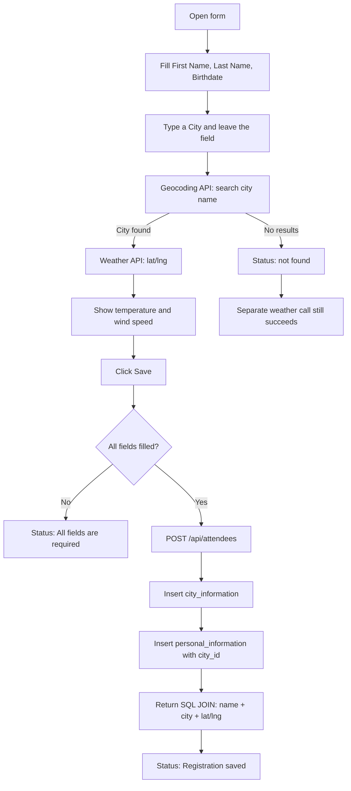

# User flow — Attendee Registration

Start the app, then open the form:

```bash
npm install
npm start
```

Open http://localhost:3000

---

## What the app does

You register an attendee. When a city is entered, the app looks up that city’s coordinates, then loads current weather. Save stores the person and the city in two SQL tables, linked by `city_id`.



---

## Happy path (valid city)

1. Enter **First Name**, **Last Name**, and **Birthdate** (date picker).
2. Type a real city, for example `Kigali`, then click outside the City box (or press Tab).
3. The app calls:
   - `https://geocoding-api.open-meteo.com/v1/search?name=Kigali`
   - then `https://api.open-meteo.com/v1/forecast?latitude=...&longitude=...&current_weather=true`
4. Status should say **Found Kigali.** Weather should show **temperature (°C)** and **wind speed (km/h)**.
5. Click **Save**.
6. Status should say **Registration saved.** Below the form you should see the JOIN result, for example:  
   `Mugisha Pacifique — Kigali (-1.95, 30.06)`

**Clear:** click **Clear**. The form, weather, status, and saved result should all reset.

---

## Invalid city (troubleshooting)

1. Type a fake city, for example `zzzznotacity123`, then leave the field.
2. Geocoding returns no results.
3. Status must show **`not found`**.
4. Weather can still appear, because a **separate** forecast call runs with known-good coordinates (Kigali fallback). That proves the weather API works even when the city is invalid.
5. Click **Save**. Registration must **not** be stored, because there is no valid city. Status stays **`not found`**.

---

## Empty fields (validation)

1. Leave one or more fields empty.
2. Click **Save**.
3. Status should say **All fields are required.** Nothing is sent to the database.

---

## What Save does on the backend

`POST /api/attendees` writes two tables:

| Table | What is stored |
| --- | --- |
| `city_information` | city name, latitude, longitude |
| `personal_information` | first name, last name, birthdate, `city_id` |

Then it returns a **JOIN** of the person and their city (`name`, `city_name`, `latitude`, `longitude`).

`PATCH /api/attendees/:id` updates only the birthdate. If the id does not exist, it returns **404 Attendee not found.**

---

## Tests you should run

### 1. Automated tests

```bash
npm test
```

Expected: **2 tests pass**.

| Test | What it checks |
| --- | --- |
| POST `/api/attendees` | Saves both tables and returns the JOIN (name + city + coordinates) |
| PATCH `/api/attendees/999` | Missing attendee returns **404** and `Attendee not found.` |

That PATCH case is the required bonus unit test.

### 2. Manual checks in the browser

Do these at http://localhost:3000:

- [ ] Form has First Name, Last Name, Birthdate, City, **Save**, and **Clear**
- [ ] Valid city (e.g. `Kigali`) shows temperature and wind speed
- [ ] Invalid city (e.g. `zzzznotacity123`) shows status **`not found`**, and weather still loads
- [ ] Save with a missing field shows **All fields are required.**
- [ ] Save with a valid city shows **Registration saved.** and the person’s name with city/lat/lng
- [ ] **Clear** empties the form and hides weather/result

### 3. Optional API check for PATCH

After a successful Save, you can confirm the update endpoint (use the real id from the save response if you inspect Network):

```bash
# Missing person — this is the case the unit test covers
curl -X PATCH http://localhost:3000/api/attendees/999 -H "Content-Type: application/json" -d "{\"birthdate\":\"1995-04-12\"}"
```

Expected: `{"error":"Attendee not found."}`
